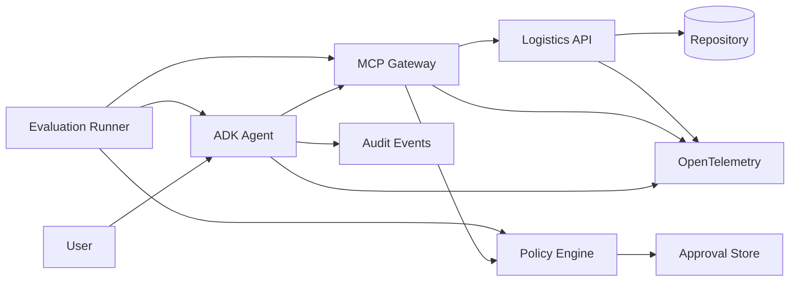

# Logistics Agent Platform

A production-oriented reference implementation for building, governing, observing, and evaluating MCP-based AI agents.

The project uses a synthetic logistics scenario: an AI agent investigates shipment delays, searches alternative routes, evaluates rerouting options, and requests human approval before executing side-effect actions.

The focus is not chatbot UX. It is the engineering around production agents:

- typed MCP contracts
- identity- and scope-based tool authorization
- human approval for side effects
- retries, timeouts, budgets, and idempotency
- structured audit events
- OpenTelemetry tracing and metrics
- deterministic agent evaluation and regression gates
- multiple agent identities sharing the same governance layer

> **Status:** Local runtime, governance, observability, and deterministic evaluation are implemented and tested.
> GCP deployment and GitHub CI/CD are in progress.

## Architecture

