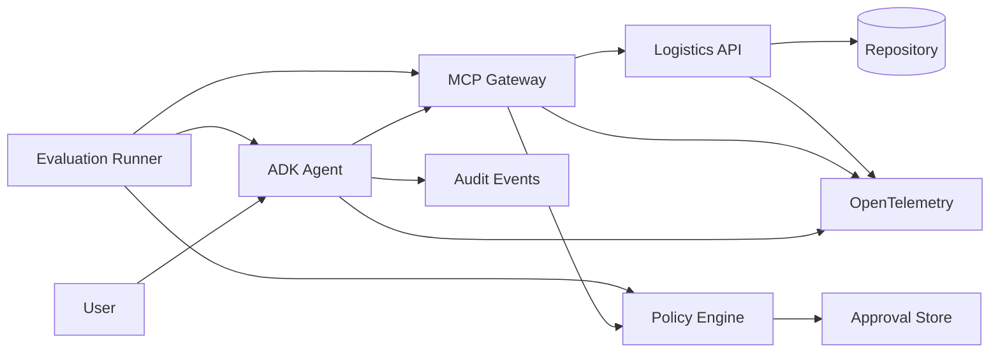

# Logistics Agent Platform

A production-oriented reference implementation for building, governing, observing, and evaluating MCP-based AI agents.

The project uses a synthetic logistics scenario: an AI agent investigates shipment delays, searches alternative routes, evaluates rerouting options, and requests human approval before executing side-effect actions.

The focus is not chatbot UX. It is the engineering around production agents:

- typed MCP contracts
- identity- and scope-based tool authorization
- human approval for side effects
- retries, timeouts, budgets, and idempotency
- structured audit events
- OpenTelemetry tracing and metrics
- deterministic agent evaluation and regression gates
- multiple agent identities sharing the same governance layer

> **Status:** Local runtime, governance, observability, and deterministic evaluation are implemented and tested.
> GCP deployment and GitHub CI/CD are in progress.

## Architecture


The agent never accesses logistics data directly. All domain operations go through typed MCP tools and the shared governance layer. Side-effect actions such as rerouting require policy authorization and human approval.

## What is implemented

| Area | Implementation |
|---|---|
| Logistics backend | Deterministic FastAPI service with synthetic shipment, port, and route data |
| MCP | Six typed tools with Pydantic input/output contracts |
| Governance | Identity, scopes, policy checks, tool-call budgets, and approval gates |
| Side effects | Idempotent rerouting protected by argument-bound human approval |
| Agent runtime | Google ADK runtime with governed MCP tool execution |
| Multi-agent | Main agent + read-only investigation agent sharing the same governance layer |
| Reliability | Retry, timeout, quota, and budget enforcement |
| Observability | Structured logs, OpenTelemetry traces, metrics, audit events, run/trace correlation |
| Evaluation | Deterministic scripted agent evaluation with regression baselines |
| Testing | Unit, contract, policy, integration, and end-to-end tests |

## Evaluation

The project treats agent behavior as a testable system rather than relying on exact model wording.

The deterministic evaluation suite runs scripted model behavior through the real MCP, policy, approval, audit, and execution stack.

It currently includes 26 cases evaluated across:

- tool selection
- forbidden actions
- tool arguments
- execution trajectory
- policy compliance
- task success
- factual grounding
- cost

Run the regression suite:

```bash
python -m evals.runner --mode deterministic
```

## Governance and safety

Tool execution is governed independently of the LLM.

Each request carries an execution context containing agent identity, delegated user identity, scopes, budgets, and trace information.

Read operations require explicit scopes. Side-effect operations additionally require policy authorization and a human approval bound to the exact action arguments.

For example:

main-agent
    → shipment:read
    → route:read
    → shipment:reroute
    → approval required

investigation-agent
    → shipment:read
    → port:read
    → route:read
    → reroute denied

The model cannot bypass these controls by changing its prompt or tool-call arguments. Authorization is enforced at the tool execution boundary.

## Observability

Every agent run is correlated across services using trace and run IDs.

The platform currently provides:

- structured JSON logs
- OpenTelemetry traces
- explicit agent and tool spans
- metrics and error categories
- audit events
- agent identity in traces
- local Jaeger visualization

This makes it possible to reconstruct:

User request
→ agent reasoning step
→ MCP tool call
→ policy decision
→ backend request
→ approval / denial
→ final result

## Disclaimer

Synthetic logistics domain. No proprietary code or data.
